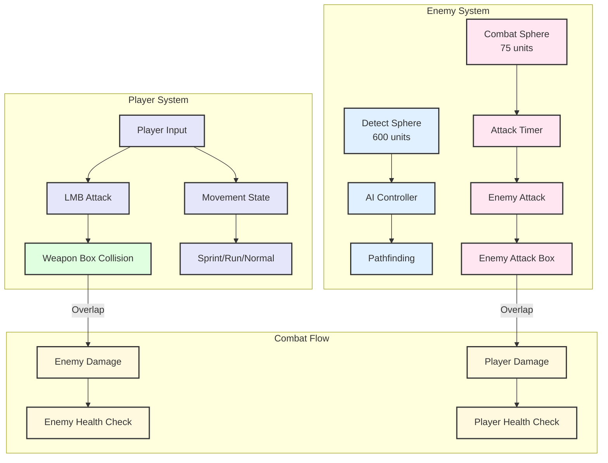

# 3D Third-Person Combat Game | Unreal Engine | C++ & Blueprint

A combat-focused action game where players fight AI-controlled enemies using melee weapons. Features proximity-based enemy AI, collision-driven combat systems, and dynamic weapon pickup mechanics.

**Tech Stack:** Unreal Engine | C++ | AIController | Animation Montages | Overlap Events

---

## Development Approach

I built this project using C++ for core gameplay systems to practice object-oriented programming and understand Unreal's architecture at a deeper level. Each class handles a specific responsibility - Enemy manages AI behavior and attack logic, MainCharacter handles player input and movement states, and Weapon controls pickup interactions and damage detection.

The collision system uses sphere components for detection ranges and box components for damage volumes. I connected these through delegate-based overlap events, keeping classes loosely coupled while allowing them to communicate. For instance, Enemy detects the player through DetectSphere but doesn't directly control damage - instead it enables collision detection flags that AttackHitBox checks independently.



---

## Key Technical Systems

### Detection Zone AI

Enemies use nested collision spheres to create behavior zones. The outer DetectSphere (600 unit radius) triggers AIController pathfinding toward the player. When the player enters the inner CombatSphere (75 units), the enemy stops moving and queues an attack with randomized timing between 0.2-0.7 seconds using timers.

I had the AI continue chasing during attacks initially, causing enemies to slide while playing attack animations. The fix was checking `bAttacking` in `MoveToTarget()` and calling `StopMovement()` when `Attack()` fires. When `AttackEnded()` executes, I check if the player is still in CombatSphere - if yes, queue another attack; if no, resume pathfinding.
```cpp
void AEnemy::MoveToTarget(AActor* Target)
{
    if (bAttacking) return;
    
    if (AIController)
    {
        FAIMoveRequest MoveRequest;
        MoveRequest.SetGoalActor(Target);
        MoveRequest.SetAcceptanceRadius(5.0f);
        AIController->MoveTo(MoveRequest);
    }
}
```

### Attack State Machine

Both player and enemy attacks use AnimMontages with boolean flags to control hit detection. When the player presses LMB, the code plays a random attack animation and sets `bCanDetectDamageCollision = true`. The weapon's AttackHitBox only registers hits when this flag is active, preventing damage during windup or recovery frames.

I struggled with multiple hits per swing - a single attack would deal damage repeatedly during one animation. The issue was not resetting the flag after the first hit. Solution: set `bCanDetectDamageCollision = false` immediately in the overlap callback. This makes damage frame-perfect but single-hit-per-attack.
```cpp
void AMainCharacter::Attack()
{
    if (!bAttacking)
    {
        bAttacking = true;
        bCanDetectDamageCollision = true;
        
        int32 Section = FMath::RandRange(0, 2);
        UAnimMontage* Montage = AttackMontages[Section];
        PlayAnimMontage(Montage);
    }
}
```

### Weapon Pickup System

Weapons spawn as actors with a SphereCollision for pickup detection. They rotate continuously until `Used` becomes true. When the player overlaps the sphere, the weapon attaches to `RightHandSocket`, stops rotating, and adds its AttackHitBox to the player's overlap delegate list. This means the player doesn't need to know about weapon internals - weapons register themselves when equipped.
```cpp
void AWeapon::OnSphereBeginOverlap(UPrimitiveComponent* OverlappedComponent, 
    AActor* OtherActor, UPrimitiveComponent* OtherComp, 
    int32 OtherBodyIndex, bool bFromSweep, const FHitResult& SweepResult)
{
    if (OtherActor)
    {
        AMainCharacter* Main = Cast<AMainCharacter>(OtherActor);
        if (Main)
        {
            Main->PickupWeapon(this);
            Used = true;
        }
    }
}
```

---

## Technical Challenges

**AI Pathfinding State:** Early on, enemies would get stuck chasing after the player left DetectSphere because I wasn't clearing `TargetChar` reference on overlap end. Added nullptr check and `StopMovement()` call in `DetectSphereOnEndOverlap` to fix.

**Movement During Attacks:** Both player and enemy could move while attacking because I was only checking animation state, not the `bIsAttacking` flag in movement input. Added guard clauses in `MoveForward/MoveRight` that block input when attacking.

**Sprint State Management:** Sprint would activate even when standing still, causing animation issues. Added velocity check in `SprintKeyDown()` - sprint only activates if `GetCharacterMovement()->Velocity.Size() > 0`.
```cpp
void AMainCharacter::SprintKeyDown()
{
    if (GetCharacterMovement()->Velocity.Size() > 0)
    {
        bSprinting = true;
        GetCharacterMovement()->MaxWalkSpeed = SprintSpeed;
    }
}
```

---

## What I Learned

Collision-based AI is simpler to implement than behavior trees for basic enemies but harder to debug - I spent time tracking down why enemies weren't attacking until I realized CombatSphere radius was too small. Boolean flag management for hit detection taught me about frame-perfect logic and why fighting games disable collision during certain frames. The sphere-based detection zones naturally create difficulty scaling - tighter CombatSphere means players must get closer before enemies attack.

[](https://youtu.be/_8WCMwCWB4E)
### [Gameplay Video](https://youtu.be/_8WCMwCWB4E)


